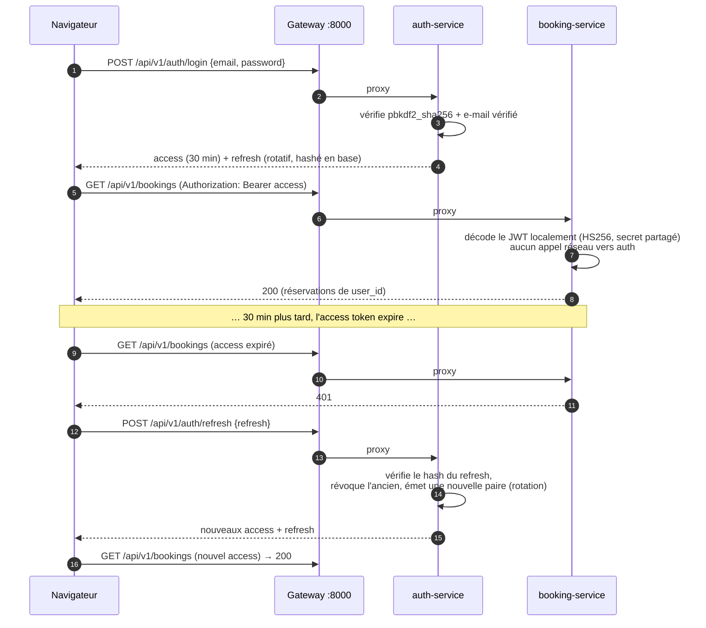
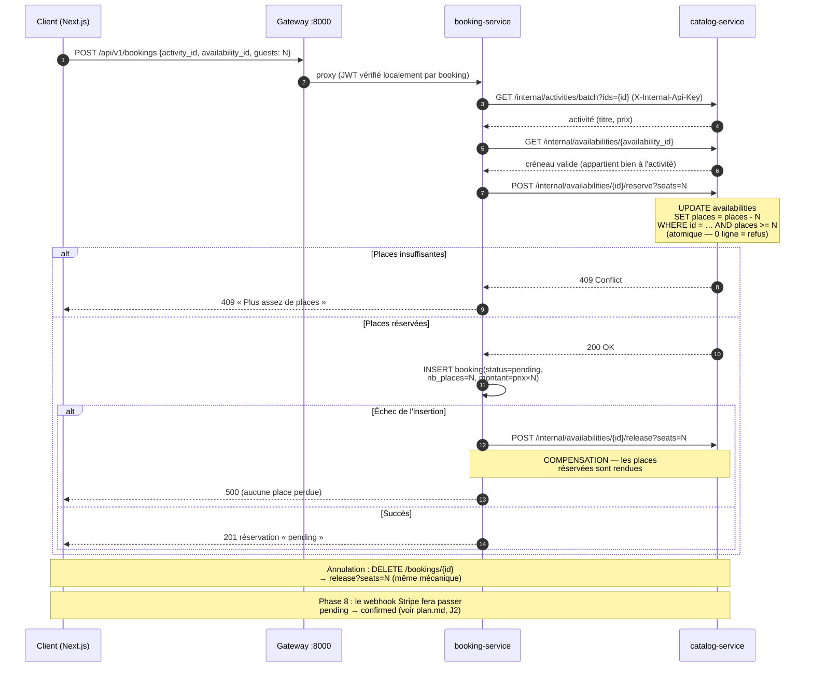

# Architecture TouriBook — Microservices & Micro-frontends

> Document de référence de l'architecture **réellement en place** (màj 13/08/2026).
> Démarrage rapide : voir le [README](../README.md) · Avancement : [plan.md](plan.md) · Modèle de données : [mcd.md](mcd.md)

**Sommaire** : [1. Vision](#1-vision-générale) · [2. Vue d'ensemble](#2-vue-densemble) ·
[3. Microservices](#3-les-microservices) · [4. Patterns](#4-patterns-darchitecture-appliqués) ·
[5. Frontend](#5-frontend--frontend-workspace-npm) · [6. Code partagé](#6-code-partagé-backend--libscommon-touribook_common) ·
[7. Bases de données](#7-bases-de-données-migrations--seeds) · [8. Démarrage](#8-démarrage) ·
[9. Variables d'env](#9-variables-denvironnement) · [10. Sécurité](#10-sécurité) ·
[11. Déploiement](#11-déploiement-docker-compose) · [12. Limites connues & risques](#12-limites-connues-risques--améliorations-ciblées) ·
[13. Décisions d'architecture (ADR)](#13-décisions-darchitecture-adr) · [14. Feuille de route](#14-feuille-de-route-technique)

## 1. Vision générale

TouriBook est une plateforme de réservation d'activités touristiques (Tunisie),
découpée de bout en bout :

- **Backend** : 7 microservices FastAPI — un service par domaine métier, une
  base de données par service, derrière un **API Gateway** unique (port 8000).
- **Frontend** : 2 micro-frontends dans un workspace npm —
  - **site client en Next.js 16** (App Router, rendu serveur → SEO), port 5173 ;
  - **espace admin en Vite/React** (SPA privée, pas de besoin SEO), port 5174,
    servi sous `/admin` avec sa propre page de login.
- **Code partagé** : `libs/common` (Python) et `frontend/packages/@touribook/*`
  (TypeScript, compatibles Vite **et** Next).

## 2. Vue d'ensemble

```text
  ┌──────────────────────────────┐   ┌───────────────────────────┐
  │  SITE CLIENT — NEXT.JS :5173 │   │  APP ADMIN — VITE         │
  │  frontend/apps/client        │   │  :5174/admin              │
  │  SSR/SEO : accueil, catalog, │   │  frontend/apps/admin      │
  │  détail + sitemap + JSON-LD  │   │  login admin · dashboard  │
  │  îlots client : recherche,   │   │  users · bookings ·       │
  │  favoris, réservation, auth  │   │  activités · paiements    │
  └──────┬───────────────┬───────┘   └────────────┬──────────────┘
         │ SSR (direct)  │ axios /api (proxy)     │ axios /api (proxy Vite)
         │ API_INTERNAL_ │      packages partagés @touribook/*
         │ URL           │      (ui · api · auth · i18n)
         ▼               ▼                        ▼
                   ┌────────────────────────────┐
                   │  API GATEWAY      :8000    │
                   │  gateway/  (FastAPI+httpx) │
                   │  - routage par préfixe     │
                   │  - CORS                    │
                   │  - bloque /internal/*      │
                   └──┬───┬───┬───┬───┬───┬─────┘
     ┌────────────┬───────┘   │   │   │   │   └──────┬─────────────┐
     ▼            ▼           ▼   │   ▼   ▼          ▼             │
┌───────────┐┌───────────┐┌──────────┐┌───────────┐┌───────────┐   │
│ AUTH :8001││CATALOG    ││BOOKING   ││PAYMENT    ││REVIEW     │   │
│ users     ││:8002      ││:8003     ││:8004      ││:8005      │   │
│ tokens    ││activities ││bookings  ││payments   ││reviews    │   │
│ avatars   ││categories ││promo     ││(Stripe    ││favorites  │   │
│           ││availab.   ││codes     ││ Phase 8)  ││           │   │
└─────┬─────┘└────┬──────┘└────┬─────┘└─────┬─────┘└─────┬─────┘   │
      │           │            │            │            │         ▼
      ▼           ▼            ▼            ▼            ▼  ┌────────────┐
 ┌─────────┐┌──────────┐┌──────────┐┌──────────┐┌──────────┐│ADMIN :8007 │
 │touribook││touribook_││touribook_││touribook_││touribook_││BFF/agrégat.│
 │  (DB)   ││ catalog  ││ booking  ││ payment  ││ review   ││ (pas de DB)│
 └─────────┘└──────────┘└──────────┘└──────────┘└──────────┘└────────────┘
        PostgreSQL 16 (Docker, port hôte 5434) — une base par service

 ┌────────────────────┐        Appels internes : HTTP + X-Internal-Api-Key
 │ NOTIFICATION :8006 │◄────── (jamais exposés par le gateway)
 │ e-mails SMTP       │
 └────────────────────┘
```

## 3. Les microservices

| Service | Port | Base de données | Responsabilité |
|---|---|---|---|
| **gateway** | 8000 | — | Point d'entrée unique, routage par préfixe, CORS, blocage `/internal`, `/health` agrégé |
| **auth** | 8001 | `touribook` (historique + Alembic) | Comptes, JWT, refresh tokens rotatifs, vérification e-mail, reset mot de passe, profil, avatars (`/static`) |
| **catalog** | 8002 | `touribook_catalog` | Activités, catégories, disponibilités — réservation/libération **atomique** des places (`reserve`/`release`) |
| **booking** | 8003 | `touribook_booking` | Réservations **multi-voyageurs** (`nb_places`), annulation, codes promo (modèle) — saga avec le catalogue |
| **payment** | 8004 | `touribook_payment` | Tunnel de paiement : `create-intent`, webhook Stripe signé + idempotent, **mode simulation** sans clés (démo) |
| **review** | 8005 | `touribook_review` | Avis (par activité) et favoris (par utilisateur) |
| **notification** | 8006 | — | E-mails SMTP via fastapi-mail + templates Jinja2 — **interne uniquement** |
| **admin** | 8007 | — | BFF de l'espace admin : agrège stats et listes depuis auth/catalog/booking/payment |

### Table de routage du gateway

| Préfixe | Service |
|---|---|
| `/api/v1/auth/*`, `/static/*` (avatars — sauf `/static/activities`) | auth |
| `/api/v1/activities*`, `/api/v1/categories*`, `/api/v1/availabilities*`, `/static/activities/*` (photos) | catalog |
| `/api/v1/bookings*` | booking |
| `/api/v1/payments*` | payment |
| `/api/v1/reviews*`, `/api/v1/favorites*` | review |
| `/api/v1/admin/*` | admin |
| tout chemin contenant `/internal` | **bloqué (404)** |

### Endpoints principaux (publics)

- **auth** : `register`, `verify-email`, `resend-verification`, `login`,
  `refresh`, `logout`, `forgot-password`, `validate-reset-token`,
  `reset-password`, `change-password`, `me` (GET/PATCH/**DELETE** — suppression
  RGPD par anonymisation), `me/avatar` (POST/DELETE)
- **catalog** : `GET /activities` (recherche, `category_id`, pagination),
  `GET /activities/{id}`, `GET /activities/{id}/availabilities`, `GET /categories` ;
  **admin (JWT admin)** : CRUD `categories` / `activities` / `availabilities`,
  `POST|DELETE /activities/{id}/photo` (multipart → `/static/activities/`)
- **booking** : `GET /bookings` (mes réservations, titres enrichis),
  `POST /bookings` (`activity_id`, `availability_id`, `guests` 1-8, `promo_code`
  optionnel appliqué au montant), `GET /bookings/{id}`,
  `GET /bookings/{id}/qrcode` (SVG, après confirmation),
  `POST /bookings/validate-promo`, `DELETE /bookings/{id}` (annulation + libération)
- **review** : `GET/POST /reviews?activity_id=` (dépôt réservé aux clients ayant
  réservé — vérif interne booking), `GET /reviews/stats?activity_ids=` (moyennes),
  `GET/POST /favorites`, `DELETE /favorites/{activity_id}`
- **payment** : `POST /payments/create-intent` (JWT), `POST /payments/webhook`
  (public — signature Stripe), `POST /payments/mock-confirm` (JWT, uniquement si
  Stripe non configuré : simulation étiquetée démo)
- **admin** : `GET /admin/stats` (dashboard), `GET /admin/{users,bookings,activities,payments}` (paginé)

## 4. Patterns d'architecture appliqués

### 4.1 Database-per-service
Chaque service possède sa base. **Aucune ForeignKey inter-services** : les
références (`user_id`, `activity_id`, `availability_id`, `booking_id`) sont de
simples entiers, validées par appel API au service propriétaire.
Justification et limites : [ADR-002](#adr-002--une-base-postgresql-par-service).

### 4.2 Authentification stateless (JWT partagé)
- `auth-service` émet les JWT (HS256, secret partagé `JWT_SECRET_KEY`).
- Les autres services **vérifient le token localement**
  (`touribook_common.auth.get_current_identity` / `require_admin`) sans appel
  réseau : l'identité (`user_id`, `role`) est lue dans les claims.
- Access token 30 min ; refresh token **rotatif**, stocké hashé, révocable.
- Justification et limites : [ADR-003](#adr-003--jwt-hs256-partagé-validation-locale).



### 4.3 Communication inter-services
- **Synchrone** : HTTP/JSON via `touribook_common.internal.ServiceClient`.
- Les endpoints `/internal/*` sont protégés par le header `X-Internal-Api-Key`
  (clé partagée `INTERNAL_API_KEY`) et **jamais routés par le gateway**.
- Endpoints internes types : `/internal/stats/*`, `/internal/*/batch?ids=`,
  `/internal/availabilities/{id}/reserve|release?seats=`.
- Limites (pas de timeout/retry systématiques) : voir [§12](#12-limites-connues-risques--améliorations-ciblées).

### 4.4 API Composition — admin-service (BFF)
L'ancien monolithe faisait des jointures SQL entre `users`, `bookings`,
`payments`, `activities`. L'admin-service reproduit les **mêmes réponses** en
agrégeant les endpoints internes (`asyncio.gather` + résolutions par lots
`/internal/*/batch`) — le frontend admin n'a pas changé de contrat.
Justification : [ADR-004](#adr-004--un-bff-pour-lespace-admin).

### 4.5 Saga de réservation (multi-voyageurs)
`POST /bookings` orchestre :
1. vérification de l'activité et du créneau auprès du catalog-service ;
2. **réservation atomique de N places** (`UPDATE … WHERE places_disponibles >= N`,
   pas de race condition entre réservations concurrentes) ;
3. création de la réservation locale (`nb_places`, `montant_total = prix × N`) ;
4. **compensation** (`release?seats=N`) si l'étape 3 échoue.
L'annulation (`DELETE /bookings/{id}`) libère le même nombre de places.
Justification et modes de défaillance : [ADR-005](#adr-005--saga-orchestrée-synchrone) et [§12](#12-limites-connues-risques--améliorations-ciblées).



### 4.6 Notifications découplées
`auth-service` ne parle jamais à SMTP : il poste vers `notification-service`
en tâche de fond (`BackgroundTasks`). Un e-mail qui échoue n'impacte jamais
la réponse HTTP à l'utilisateur.

## 5. Frontend — `frontend/` (workspace npm)

```text
frontend/
├── package.json               # workspace npm : apps/* + packages/*
├── apps/
│   ├── client/                # NEXT.JS 16 (App Router) — site public :5173
│   │   ├── next.config.ts     #   output standalone + rewrites /api & /static → gateway
│   │   └── src/
│   │       ├── app/           #   routes (voir tableau ci-dessous)
│   │       ├── views/         #   pages client réutilisées (⚠ `pages/` est réservé par Next)
│   │       ├── components/    #   Navbar 2 rangées, cartes, îlots (FavoriteButton, BookingCard…)
│   │       ├── features/      #   catalog / bookings / favorites / auth (hooks React Query)
│   │       └── lib/           #   server-api.ts (fetch SSR → gateway), site.ts
│   └── admin/                 # VITE/React — SPA privée :5174, base /admin/
│       └── src/               #   login admin dédié, dashboard, listes (react-router)
└── packages/                  # importés EN SOURCE via alias TS/Vite → packages/*/src
    ├── ui/                    # thème Tailwind v4 (palette design), composants, DataTable
    ├── api/                   # axios + refresh auto sur 401, endpoints, query-client
    │                          #   env.ts lit VITE_* (Vite) OU NEXT_PUBLIC_* (Next)
    ├── auth/                  # store zustand persist, AuthProvider(loginUrl), useAuth
    └── i18n/                  # i18next fr/en/ar + RTL — SSR-safe (guard `window`)
```

### 5.1 Site client Next.js — structure SEO

| Route | Rendu | SEO |
|---|---|---|
| `/` | **Serveur** (activités populaires dans le HTML) | metadata + contenu indexable |
| `/activities` | **Serveur** — les filtres (`?search=&cat=&sort=&view=`) re-rendent la page côté serveur | chaque combinaison de filtres = URL indexable |
| `/activities/[id]` | **SSG + ISR 60 s** (`generateStaticParams`) | `generateMetadata` par activité + **JSON-LD** `TouristAttraction`/`Offer` |
| `/sitemap.xml`, `/robots.txt` | générés depuis le catalogue | pages compte exclues de l'indexation |
| `/login`, `/register`, `/verify-email`, `/forgot-password`, `/reset-password`, `/check-email` | client (groupe `(auth)` + garde `GuestOnly`) | toutes exclues via robots.txt |
| `/favorites`, `/bookings` | client — invitent à se connecter si visiteur non authentifié | exclus via robots.txt |
| `/profile` | client (garde `RequireAuth` → `/login?next=…`) | exclu via robots.txt |

- **Îlots client** dans les pages serveur : `HeroSearch`, `CatalogControls`
  (écrit les filtres dans l'URL), `FavoriteButton`, `BookingCard`.
- **Données** : côté serveur, `lib/server-api.ts` appelle directement le gateway
  (`API_INTERNAL_URL`, revalidation 60 s) ; côté navigateur, axios passe par le
  proxy `/api` (rewrite Next qui retire le préfixe — même convention que Vite).
- **Polices** : `next/font` (Marcellus + Albert Sans) injectées dans le thème
  Tailwind via `--font-display` / `--font-sans`.
- **Langue** : le HTML serveur est rendu en français (langue du contenu) ;
  le sélecteur fr/en/ar traduit l'interface côté client. Évolution possible :
  routes localisées `/fr|/en|/ar` + hreflang.

### 5.2 Identité visuelle (maquette 08/2026)

Palette dans `packages/ui/src/styles.css` (tokens Tailwind v4) : sable
`#F6F0E4`, encre `#1C3641` (`ink`), sarcelle `#0F7C8C` (`primary`), terracotta
`#C75B33` (`accent`), or `#E4A93E` (`gold`), carte ivoire `#FFFDF7`.
Titres en Marcellus (`.font-display`), texte en Albert Sans.

### 5.3 Navigation inter-apps & sessions

- Chaque app référence l'autre par URL d'environnement :
  `NEXT_PUBLIC_ADMIN_URL` (client → admin) et `VITE_CLIENT_URL` (admin → client).
- **Dev** : deux origines (5173/5174) → sessions séparées, l'admin se connecte
  sur `/admin/login`. **Prod** : une seule origine via nginx → session
  (localStorage) partagée.
- Pas de redirection forcée : un admin navigue librement sur le site public ;
  l'espace admin est accessible via le menu profil et le footer.

## 6. Code partagé backend — `libs/common` (`touribook_common`)

| Module | Rôle |
|---|---|
| `config` | Settings communs (JWT, clé interne) — chaque service étend avec les siens |
| `security` | Hash mots de passe (pbkdf2_sha256), JWT, tokens e-mail — compatible données existantes |
| `auth` | Dépendances FastAPI `get_current_identity` / `require_admin` (sans DB) |
| `internal` | `require_internal_key` + `ServiceClient` (GET/POST avec `params`) |
| `database` | Fabrique engine/session SQLAlchemy (`pool_pre_ping`) |
| `pagination` | `Page[T]` + helper `paginate` |
| `exceptions`, `logging`, `limiter` | Handlers d'erreurs, logs par service, rate limiting compatible proxy (`X-Forwarded-For`) |

Installé en editable dans le venv racine : `pip install -e libs/common`.
En Docker : copié et installé dans chaque image.

## 7. Bases de données, migrations & seeds

- **auth** conserve la base historique `touribook` et son **historique Alembic**
  (`services/auth/alembic`) : les comptes existants restent valides.
- Les autres services créent leurs tables au démarrage (`AUTO_CREATE_TABLES=True`,
  dev). En production : ajouter un Alembic par service.
- `scripts/create_databases.py` crée les bases manquantes sur le Postgres local ;
  `infra/postgres/init.sql` fait pareil au premier démarrage du conteneur.
- **Seeds** (idempotents) :
  - `services/auth/scripts/seed_admin.py` — compte admin initial
    (`FIRST_ADMIN_EMAIL` / `FIRST_ADMIN_PASSWORD`) ;
  - `services/catalog/scripts/seed_catalog.py` — 5 catégories, 8 activités
    tunisiennes géolocalisées, ~88 créneaux de disponibilité.

## 8. Démarrage

### Dev local (backend en processus, Postgres en Docker)
```powershell
# 1. Environnement Python (une fois)
python -m venv .venv
.venv\Scripts\pip install -r requirements-dev.txt
.venv\Scripts\pip install -e libs/common

# 2. Base de données (Postgres sur localhost:5434)
docker compose up -d postgres

# 3. Backend : gateway + 7 services (-Seed crée l'admin la 1re fois)
.\scripts\dev.ps1 -Seed
# (catalogue : cd services/catalog ; ..\..\.venv\Scripts\python scripts\seed_catalog.py)

# 4. Frontends (Next client :5173 + Vite admin :5174, via concurrently)
cd frontend
npm install
npm run dev
```
Arrêt backend : `.\scripts\stop-dev.ps1` (tue les ports 8000-8007).

### Tout en Docker
```powershell
copy .env.example .env               # remplir les secrets
docker compose up --build
# → http://localhost:8080  (nginx : / → client Next SSR, /admin/ → admin, /api → gateway)
```

### Vérifications
- `http://localhost:8000/health` — état du gateway **et** de chaque service
- `http://localhost:8001/docs` … `8007/docs` — Swagger par service
- Tests backend : `cd services/auth && ..\..\.venv\Scripts\python -m pytest` (parcours auth complet)
- Tests frontend : `cd frontend && npm run test` (vitest) · `npm run typecheck`

## 9. Variables d'environnement

Chaque service backend lit son `services/<nom>/.env` (voir les `.env.example`) ;
docker-compose lit les secrets dans le `.env` racine.

**Identiques dans tous les services backend :**
- `JWT_SECRET_KEY` — signature des tokens
- `INTERNAL_API_KEY` — protection des endpoints internes

**Frontend client (Next)** : `NEXT_PUBLIC_API_URL` (=`/api`),
`NEXT_PUBLIC_ADMIN_URL`, `NEXT_PUBLIC_SITE_URL` (canonical/sitemap),
`API_INTERNAL_URL` (fetch SSR → gateway, jamais exposée au navigateur).
**Frontend admin (Vite)** : `VITE_API_URL`, `VITE_API_PROXY_TARGET`,
`VITE_CLIENT_URL`.

## 10. Sécurité

- JWT access 30 min + refresh token **rotatif** stocké hashé (révocation en base,
  invalidation à la réinitialisation du mot de passe)
- Mots de passe pbkdf2_sha256 (passlib) — hashes existants compatibles
- Rate limiting (slowapi) sur les routes sensibles, clé = `X-Forwarded-For`
- `/internal/*` : clé partagée + inaccessibles depuis l'extérieur (gateway)
- Vérification d'e-mail obligatoire avant login ; réponses anti-énumération
  sur `forgot-password` / `resend-verification`
- Les anciens endpoints de debug du monolithe ont été **supprimés**
- Limites assumées (HS256 partagé, clé interne unique) : voir §12 et ADR-003.

## 11. Déploiement (docker-compose)

| Conteneur | Image | Rôle |
|---|---|---|
| `postgres` | postgres:16-alpine | 5 bases (`touribook` via `POSTGRES_DB` + 4 via `init.sql`), volume `pgdata`, port hôte 5434 |
| `auth`…`admin` | `services/*/Dockerfile` | un conteneur par microservice |
| `gateway` | `gateway/Dockerfile` | port 8000 exposé |
| `client` | `frontend/Dockerfile.client` | **Next standalone** (SSR), `API_INTERNAL_URL=http://gateway:8000` |
| `web` | `frontend/Dockerfile` + `infra/nginx/web.conf` | nginx port 8080 : `/` → client:3000, `/admin/` → statique, `/api` + `/static` → gateway |

## 12. Limites connues, risques & améliorations ciblées

Analyse critique de l'architecture actuelle. Chaque limite est **assumée et documentée**, avec une
amélioration **proportionnée à un PFE** (pas de Kubernetes, pas de broker tant que rien ne le justifie).
Les améliorations `planifié` sont des tâches du [plan.md](plan.md) (jalon indiqué).

| # | Limite / risque | Conséquence concrète | Amélioration proportionnée | Statut |
|---|---|---|---|---|
| 1 | **Pas de timeout ni retry** sur les appels inter-services (`ServiceClient`) | catalog lent ou down → `POST /bookings` bloqué ; le BFF admin gèle si un service ne répond pas | Timeout court (2–5 s) sur tous les appels httpx + 1 retry sur les GET idempotents + erreur 503 propre côté appelant | 🔜 planifié (J3) |
| 2 | **Réservations `pending` jamais expirées** : sans paiement, les places restent décrémentées indéfiniment | Un utilisateur qui abandonne avant de payer bloque des places pour tout le monde | Tâche périodique (ou vérification à la lecture) : `pending` de plus de N min → `cancelled` + `release?seats=N` | 🔜 planifié (J3) |
| 3 | **Saga : crash entre `reserve` et l'INSERT** (ou compensation qui échoue) | Places « fantômes » réservées sans réservation en face — incohérence catalog/booking | Script de réconciliation (comparer places réservées vs somme des bookings actifs) exécutable à la demande ; la compensation existante couvre déjà le cas d'échec applicatif | 🔜 planifié (J3, avec le n° 2) |
| 4 | **Gateway = point de défaillance unique** (comme le Postgres unique) | Gateway down → toute la plateforme down | Assumé à cette échelle : `restart: always` + healthchecks docker-compose ; la scalabilité horizontale du gateway est une perspective | 🔜 planifié (J3) |
| 5 | **HS256 à secret partagé** : chaque service détient le secret de signature | Un service compromis peut forger des tokens admin | Assumé (réseau interne docker-compose, secret fort) ; évolution documentée : RS256 + JWKS exposé par auth-service — seuls les services vérifient, seul auth signe | 📋 perspective (ADR-003) |
| 6 | **`INTERNAL_API_KEY` unique** pour tous les services | Pas de traçabilité par appelant ; une fuite expose tous les endpoints internes | Assumé ; évolution : une clé par service appelant (simple dict), voire mTLS | 📋 perspective |
| 7 | **Observabilité limitée** : logs par service, non corrélés | Déboguer un parcours multi-services = lire 4 fichiers de logs sans lien | Middleware `X-Request-ID` : généré au gateway, propagé aux services et aux appels internes, inclus dans chaque ligne de log | 🔜 planifié (J3) |
| 8 | **`AUTO_CREATE_TABLES` hors auth** : pas de migrations versionnées | Toute évolution de schéma hors auth est non rejouable / non réversible | Assumé en dev ; Alembic par service avant toute vraie prod | 📋 perspective |
| 9 | **Notifications best-effort** : si notification-service est down, l'e-mail est perdu | Un utilisateur peut ne jamais recevoir son e-mail de vérification | Assumé (bouton « renvoyer l'e-mail » déjà en place = filet de sécurité) ; évolution : file de messages persistée | 📋 perspective |
| 10 | **Annulation d'une réservation payée** : aucun flux de remboursement | Après la Phase 8, annuler une réservation `confirmed` poserait la question du remboursement | Décision de cadrage : l'annulation en ligne n'est permise que sur les réservations `pending` ; le remboursement Stripe est une perspective | 🔜 à trancher (Phase 8) |
| 11 | **Webhook Stripe à venir** : risques de faux événements et de doublons | Confirmation frauduleuse ou double confirmation d'une réservation | Prévu dès la conception (plan.md Phase 8) : vérification de signature Stripe + idempotence sur `event.id` ; route publique dédiée sans JWT | 🔜 planifié (J2) |
| 12 | **Données personnelles (RGPD)** : e-mails, réservations, avatars répartis sur plusieurs bases | Le rapport doit adresser le sujet | ✅ Fait : `DELETE /auth/me` (anonymisation + révocation des sessions) + page `/privacy` ; reste la section dédiée dans le rapport | ✅ implémenté (reste : rapport) |

## 13. Décisions d'architecture (ADR)

Format condensé : **Contexte → Décision → Alternatives écartées → Conséquences**.
Ces décisions sont **déjà appliquées** dans le code.

### ADR-001 — Microservices (7 services + gateway) plutôt que monolithe

- **Contexte** : le projet a démarré en monolithe FastAPI ; le PFE vise à démontrer la conception
  d'une architecture distribuée et la migration a été réalisée en août 2026.
- **Décision** : 7 services alignés sur les domaines métier (auth, catalog, booking, payment,
  review, notification, admin/BFF) derrière un gateway unique.
- **Alternatives écartées** :
  - *Monolithe modulaire* — plus simple à opérer en solo, mais ne démontre ni l'isolation des
    domaines, ni la communication inter-services, ni les problèmes de cohérence distribuée qui
    constituent l'intérêt pédagogique du sujet.
  - *Microservices + orchestrateur (Kubernetes)* — surdimensionné : un seul développeur, une seule
    machine cible, docker-compose suffit.
- **Conséquences** : + frontières nettes, services testables isolément, tolérance partielle aux
  pannes (le catalogue reste consultable si booking est down) ; − latence réseau interne, cohérence
  à gérer applicativement (saga, §4.5), 8 processus à démarrer (7 services + gateway — scripté, §8).

### ADR-002 — Une base PostgreSQL par service

- **Contexte** : le monolithe joignait librement `users`, `bookings`, `activities`, `payments` en SQL.
- **Décision** : database-per-service (5 bases) ; aucune FK inter-services ; références par
  identifiants entiers validés via API.
- **Alternatives écartées** :
  - *Base unique partagée* — couplage par le schéma : une migration d'un service peut casser les
    autres, et l'isolation des domaines devient fictive.
  - *Un serveur PostgreSQL par service* — coût mémoire injustifié en local ; une instance, N bases,
    offre la même isolation logique.
- **Conséquences** : + services réellement autonomes, modèle de données par domaine ; − plus de
  jointures SQL globales → API Composition dans le BFF (ADR-004) et endpoints `/batch` ; cohérence
  référentielle applicative (un `activity_id` supprimé doit être toléré par les lecteurs).

### ADR-003 — JWT HS256 partagé, validation locale

- **Contexte** : chaque requête authentifiée traverse le gateway puis un service ; valider le token
  ne doit pas coûter un appel réseau.
- **Décision** : auth-service signe en HS256 avec `JWT_SECRET_KEY` partagé ; tous les services
  valident localement (`get_current_identity`), les claims portent `sub` (id utilisateur) et `role`.
- **Alternatives écartées** :
  - *Introspection centralisée* (appel à auth-service à chaque requête) — latence et couplage :
    auth deviendrait un point de passage obligé de chaque requête.
  - *Sessions serveur partagées* (Redis) — réintroduit un état partagé et une dépendance
    d'infrastructure, contraire à l'approche stateless.
  - *RS256 + JWKS* — meilleure séparation (seul auth possède la clé privée) ; écarté **pour
    l'instant** car le gain est faible tant que tous les services tournent dans le même
    docker-compose de confiance. Documenté comme évolution (§12 n° 5).
- **Conséquences** : + validation O(1) sans réseau, services stateless ; − tout détenteur du secret
  peut forger des tokens (risque assumé, §12) ; révocation d'un access token impossible avant son
  expiration → durée courte (30 min) + refresh rotatif révocable.

### ADR-004 — Un BFF pour l'espace admin

- **Contexte** : le dashboard admin affiche des données croisées (réservations + utilisateurs +
  activités + paiements) qui vivaient dans des jointures SQL du monolithe, désormais réparties
  sur 4 bases.
- **Décision** : un admin-service sans base, qui agrège en parallèle (`asyncio.gather`) les
  endpoints internes des services propriétaires, avec des résolutions par lots (`/batch?ids=`)
  pour éviter le N+1.
- **Alternatives écartées** :
  - *Agrégation côté frontend* — N appels par écran, logique de jointure dupliquée dans le client,
    exposition d'endpoints internes.
  - *Réplication des données dans une base « reporting »* — cohérence et synchronisation à gérer,
    largement prématuré.
- **Conséquences** : + le frontend admin garde le contrat de l'ancien monolithe (migration
  invisible), point unique pour les autorisations admin ; − l'admin dépend de la disponibilité des
  services sources (mitigé par timeouts, §12 n° 1).

### ADR-005 — Saga orchestrée synchrone

- **Contexte** : créer une réservation exige de décrémenter les places (catalog) **et** de créer la
  réservation (booking) — deux bases, pas de transaction commune possible.
- **Décision** : orchestration synchrone par booking-service : réserver les places d'abord
  (`UPDATE` conditionnel atomique), créer la réservation ensuite, **compenser** (`release`) si la
  création échoue.
- **Alternatives écartées** :
  - *Transaction distribuée (2PC)* — non supportée nativement, complexité disproportionnée.
  - *Saga chorégraphiée par événements* (broker) — une brique d'infrastructure de plus pour un flux
    qui n'implique que 2 services et dont l'utilisateur attend la réponse de façon synchrone.
  - *Réserver sans décrémenter, vérifier au paiement* — sur-réservation garantie en cas d'affluence.
- **Conséquences** : + pas de race condition sur les places (UPDATE conditionnel), réponse
  immédiate à l'utilisateur, compensation simple ; − couplage temporel booking → catalog (mitigé
  par timeout, §12 n° 1), fenêtres d'incohérence en cas de crash (couvertes par la réconciliation
  et l'expiration des `pending`, §12 n° 2-3).

### ADR-006 — Next.js SSR pour le site public, SPA Vite pour l'admin

- **Contexte** : le site public vit du référencement (activités touristiques cherchées sur Google) ;
  l'espace admin est privé et sans enjeu SEO.
- **Décision** : deux apps dans un même workspace npm — client Next.js 16 App Router (SSR/ISR,
  sitemap, JSON-LD) et admin Vite/React (SPA sous `/admin`) — partageant
  `@touribook/{ui,api,auth,i18n}`.
- **Alternatives écartées** :
  - *Tout en SPA* — catalogue non indexable, rédhibitoire pour une plateforme d'acquisition.
  - *Tout en Next.js* — l'admin n'a aucun besoin SSR ; Vite offre un dev server plus simple et un
    build statique servi directement par nginx.
  - *Deux dépôts séparés* — duplication du design system et du client API ; le workspace npm donne
    l'isolation sans la duplication.
- **Conséquences** : + SEO réel côté client (SSR + ISR 60 s), admin léger ; − deux toolchains à
  maintenir, les packages partagés doivent rester compatibles Vite **et** Next (contrainte
  documentée §5, ex. guard `window` dans i18n).

## 14. Feuille de route technique

L'ordre, les priorités (`must/should/nice`), les efforts (S/M/L) et les jalons datés sont dans
[plan.md](plan.md). Résumé de l'ordre retenu :

1. **J1 — CRUD admin du catalogue** (activités, catégories, créneaux) + upload de photos
2. **J2 — Phase 8 Stripe** : validation promo → `create-intent` → webhook signé + idempotent →
   `pending → confirmed` → e-mail de confirmation + QR code
3. **J3 — Qualité & robustesse** : tests (saga, E2E), CI GitHub Actions, timeouts/retry,
   expiration des `pending`, `X-Request-ID`, sauvegardes pg_dump ; Leaflet et scan QR si le rythme tient
4. **J4 — Gel & dossier PFE** : rapport, diagrammes, guide, slides, démo scriptée
5. **Perspectives** (post-PFE) : RS256/JWKS, Alembic généralisé, broker de messages, SEO
   multilingue (`/fr|/en|/ar` + hreflang), recommandations ML, panier multi-activités
