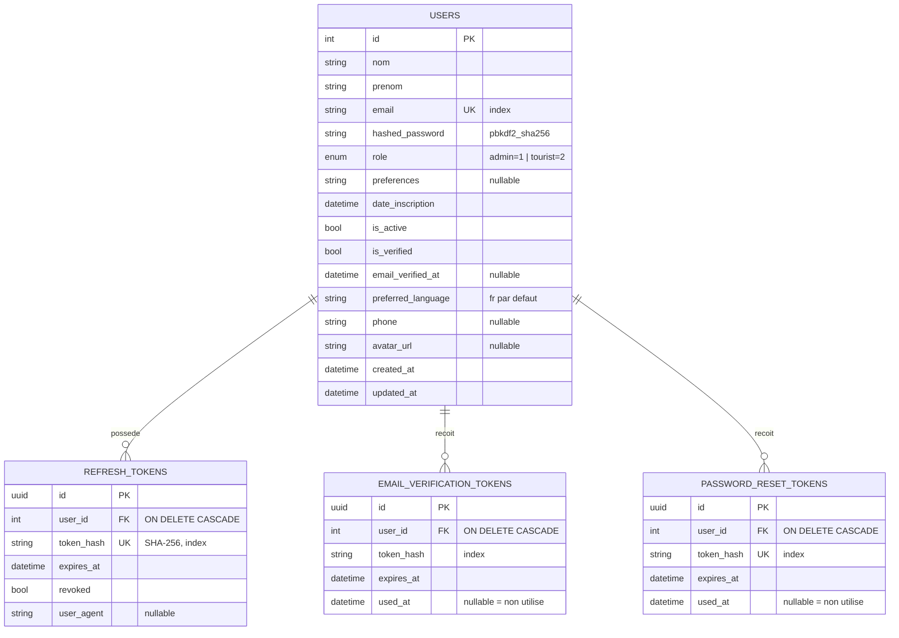
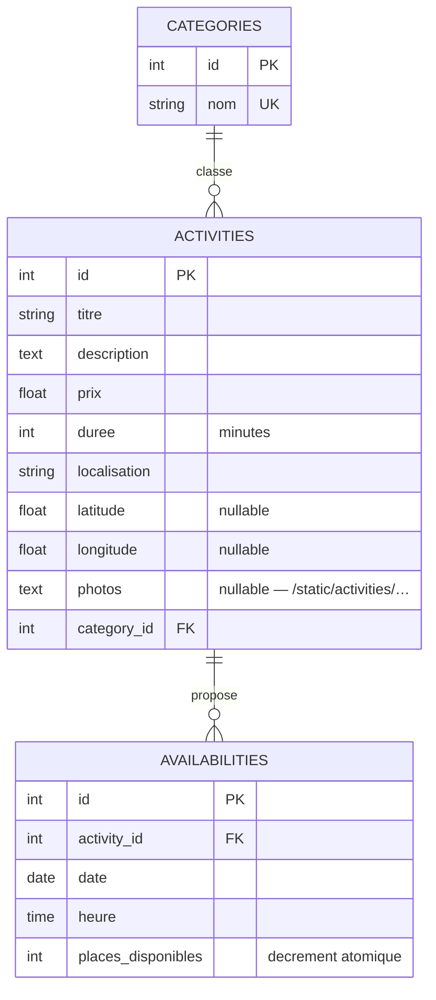
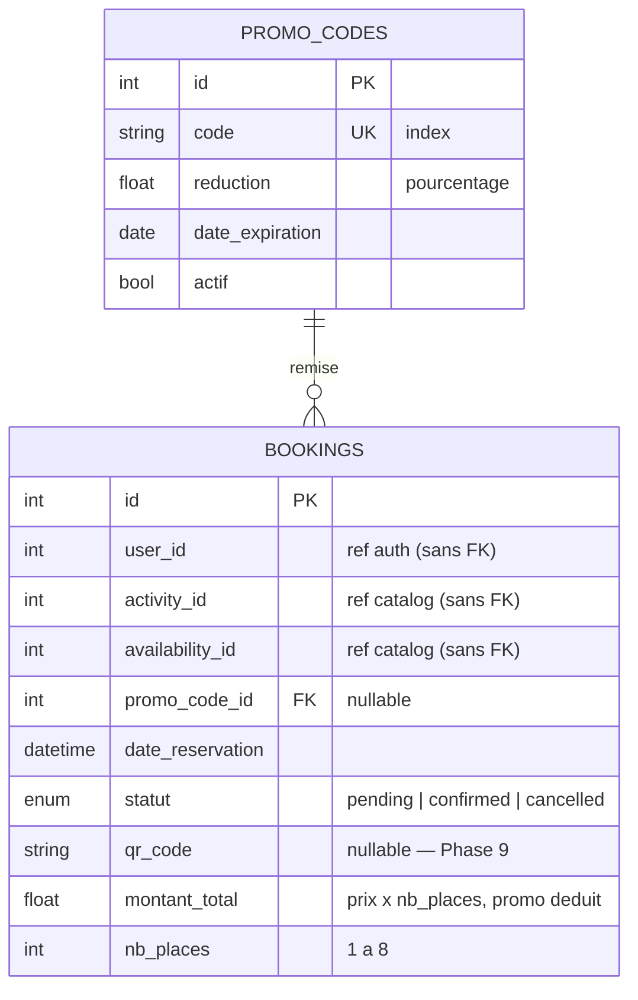
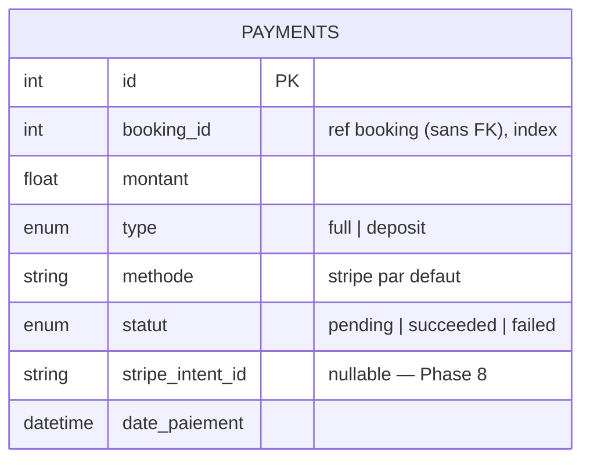
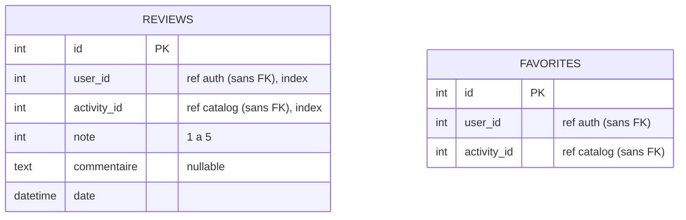
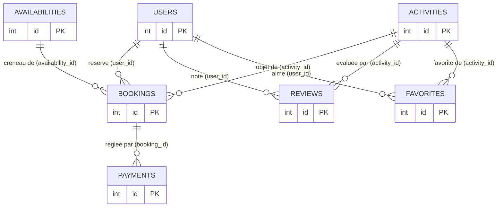

# Modèle de données TouriBook (MCD)

> Généré depuis les modèles SQLAlchemy réels (14/08/2026). Architecture
> **database-per-service** : chaque diagramme correspond à une base distincte ;
> les références inter-services (pointillés du dernier schéma) sont de simples
> entiers **sans clé étrangère**, validés par appel API (voir
> [architecture.md — ADR-002](architecture.md#adr-002--une-base-postgresql-par-service)).

## 1. Base `touribook` — auth-service

## 2. Base `touribook_catalog` — catalog-service

## 3. Base `touribook_booking` — booking-service

## 4. Base `touribook_payment` — payment-service

## 5. Base `touribook_review` — review-service

> `FAVORITES` : contrainte d'unicité `(user_id, activity_id)` — un favori par
> utilisateur et par activité.

## 6. Vue d'ensemble — relations inter-services (logiques, sans FK)

**Règles de cohérence applicative** (remplacent les FK inter-services) :
- La création d'une réservation **vérifie** l'activité et le créneau via l'API du
  catalog-service (saga, [architecture.md §4.5](architecture.md#45-saga-de-réservation-multi-voyageurs)).
- La suppression d'une activité est **refusée** s'il existe des réservations
  (garde inter-services 409).
- Le dépôt d'un avis est **refusé** si l'utilisateur n'a pas de réservation non
  annulée de l'activité (`has-booked`).
- La suppression de compte **anonymise** l'utilisateur au lieu de le supprimer :
  les `user_id` référencés ailleurs restent valides.
